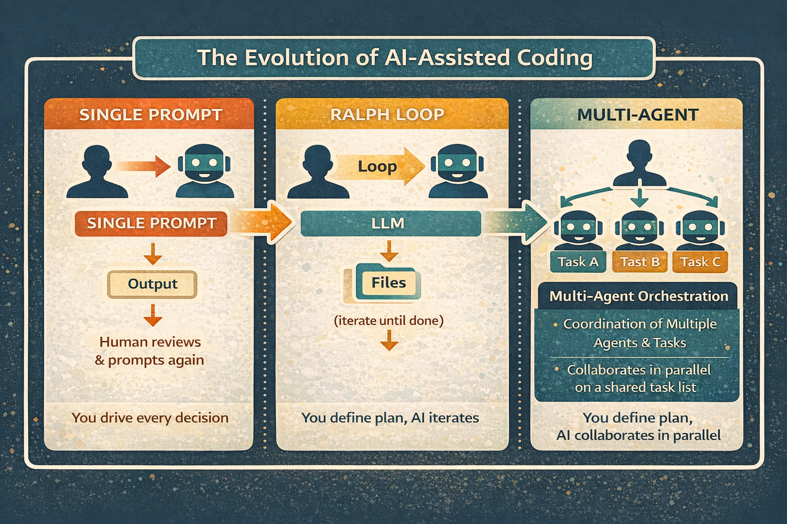
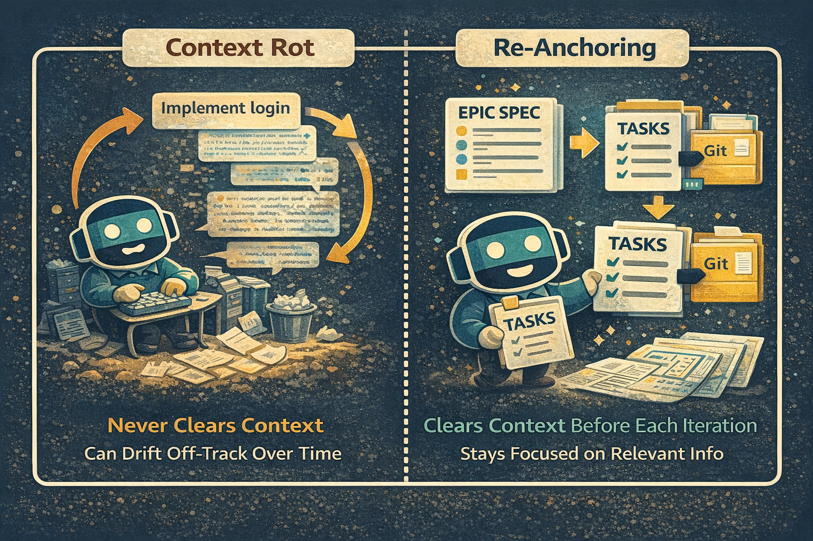

Something shifted in software engineering over the past few months. The question changed from "Can AI write this code?" to "How do I orchestrate AI to build this feature?"

The tools are getting smarter. Context windows are getting larger. The role of the engineer is becoming less about typing code and more about directing AI agents with product intuition and system thinking.

This is happening now, and the pace keeps accelerating.

   

## One Prompt at a Time

Until recently, the workflow with AI coding assistants followed a predictable pattern. You'd open your IDE, fire up your AI agent, and prompt it to implement a specific feature. Maybe fix a bug. Perhaps write a test.

The scope had to stay small. Ask for too much and the model would start hallucinating, lose track of context, or produce code that sort of worked but missed important edge cases. We learned to chunk our requests into bite-sized pieces that fit within the model's attention span.

Having an AI pair programmer felt like a superpower. But you were still driving every decision, reviewing every output, and manually stitching pieces together.

The bottleneck was the human in the loop. 

## Enter the Ralph Wiggum Technique

[Geoffrey Huntley](https://ghuntley.com/ralph/) got frustrated with this bottleneck. His solution was almost comically simple:

```bash
while :; do cat PROMPT.md | claude ; done
```

That's it. An infinite loop feeding a prompt file to Claude Code.

The insight: progress shouldn't live in the LLM's context window. It should live in your files, git history or a database to avoid "context rot".

Combined with well defined tasks and automatic tests, you steer it right and make sure there's a tight feedback loop for the AI agents to correct themselves. Define your tasks upfront, give them to Ralph, then walk away. Ralph autonomously iterates until tasks are addressed and all tests pass, writing more tests where it sees fit along the way.



## The Multi-Agent Orchestration Revolution

Once autonomous loops proved viable, parallel workflows quickly followed. Multiple parallel agents working toward the same goal or tasks, autonomously coordinating and self-correcting with each other. This means scalable capacity / speed. Likely the next team you'll need to hire.

This isn't incremental. It's a different way of building software.

## The Speed of Change

Most of these tools didn't exist a few months ago.

Ralph Wiggum emerged last summer. Gas Town launched weeks ago. Ralph-TUI, Flow-Next, and dozens of others appeared in just the past month.

The platform providers are quick too. Anthropic recently launched integrated tooling in Claude Code that handles complex, multi-task workflows natively — no third-party orchestration layer required. Tasks can be decomposed, agents can be spawned, and work can proceed in parallel, all within the official tools.

Where I think the space is heading:

- **Multi-agent workflows** where agents not only implement but also review each other's work, catching issues before humans ever see them.
- **Larger context windows** that let AI work autonomously for longer stretches without losing the thread.
- **Goal-oriented execution** where you describe the outcome you want, not the steps to get there.
- **Parallel experimentation** — test three approaches at once, keep the one that works.

The engineer's job will need to shift toward defining what good looks like. Setting constraints. Providing product intuition. Making judgment calls that require understanding users and business.

For product owners it's a dream coming true, where implementation bottlenecks are vanishing.

## Why This Matters Now

If you're a software engineer, this shift might feel unsettling. The skills that matter are changing fast.

Technical depth still counts — you need to understand systems well enough to guide AI and catch when it goes wrong. But product thinking, system design, and breaking down problems into clear specs matter more than before.

Engineers who don't adopt these tools will fall behind. Not because AI replaces engineers, but because engineers using AI orchestration ship more. The productivity gap between the two groups is growing.

The tools are accessible now. See what it feels like to manage agents instead of writing every line yourself.

For product teams: features that took weeks can now be prototyped in hours. Experimentation gets cheaper. You can try more things and learn faster.

## For the Solopreneur

The limiting factor for product-minded engineers has always been bandwidth. You have ideas for three products, the sense to know what would work, the skills to build them—but only so many hours. You had to pick one.

That constraint is loosening.

A single engineer can now manage multiple projects in parallel. Not by working more hours, but by letting AI agents handle implementation while you focus on strategy: What should we build? For whom? What's the fastest path to validation? This really excites me.


## Looking Forward

The tools are rough. Workflows aren't standardized. Best practices are being figured out in real-time. But the direction is obvious.

If you've been watching from the sidelines, start experimenting. The tools are ready.

## A Word of Caution

Write clear specs — vague in, vague out. Review before merging — agents make mistakes.

Go in with eyes open.
---

## Resources

- [Gas Town](https://github.com/steveyegge/gastown) — Steve Yegge's multi-agent workspace manager
- [The Ralph Wiggum Technique](https://ghuntley.com/ralph/) — Geoffrey Huntley's original explanation
- [Flow-Next](https://mickel.tech/apps/flow-next) — Gordon Mickel's orchestration with re-anchoring
- [Ralph-TUI](https://github.com/subsy/ralph-tui) — Terminal UI for orchestrating AI coding agents
- [Claude Code](https://docs.anthropic.com/en/docs/claude-code) — Anthropic's agentic coding tool with native orchestration
